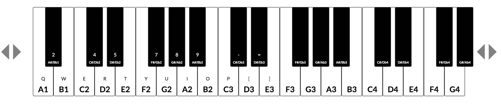
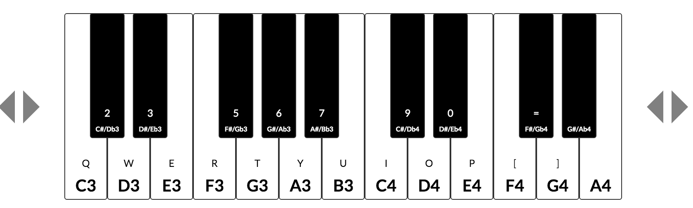
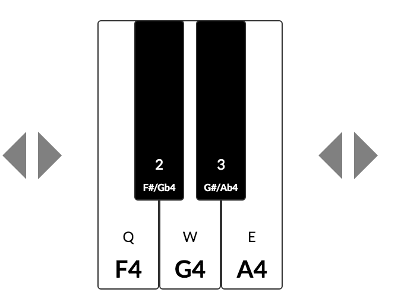
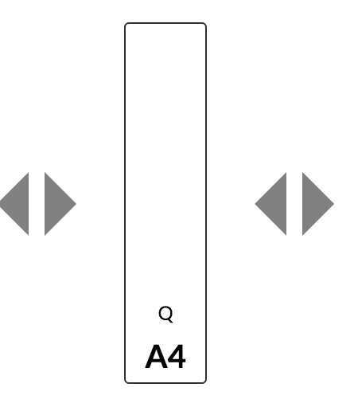

# mozart
play piano to write music

Use the buttons on the side to add to or remove from the keyboard. You can either click the keys or press keys on the keyboard (qwerty or 12345 rows) to play the leftmost keys.

Use ```npm install``` then ```npm start``` and navigate to [localhost:3000](http://localhost:3000) to use.

Key sounds made using [audiosynth](https://github.com/keithwhor/audiosynth).

### Screenshots:

Example keyboard layouts:






## License:
MIT
